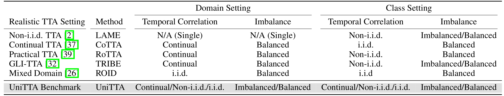

# UniTTA: Unified Benchmark and Versatile Framework Towards Realistic Test-Time Adaptation

Authors: [Chaoqun Du](https://andy-du20.github.io/),
[Yulin Wang](https://www.wyl.cool/),
[Jiayi Guo](https://www.jiayiguo.net/),
[Yizeng Han](https://yizenghan.top/),
Jie Zhou,
[Gao Huang](https://www.gaohuang.net).

[](https://arxiv.org/pdf/2407.20080)

## Introduction

<p align="center">
    
</p>

<p align="center">
    
</p>

We propose a Unified Test-Time Adaptation (UniTTA) benchmark that is both comprehensive and widely applicable. We present a novel method for constructing test data of
various scenarios using a defined Markov state transition matrix. The UniTTA benchmark can assist researchers in evaluating their methods in a more comprehensive and realistic manner, facilitating the development of versatile and robust TTA methods. Moreover, it also provides a evaluating benchmark for practitioners to select the most suitable TTA method for their specific scenarios.

<p align="center">
    
</p>

Alongside this benchmark, we propose a versatile UniTTA framework, which includes a Balanced Domain Normalization (BDN) layer and a Correlated Feature Adaptation (COFA) method–designed to mitigate distribution gaps in domain and class, respectively.
Our primary insight is to unify both domain-aware and class-aware normalization. We compute the statistics for each class within each domain and then average
across classes to obtain balanced domain-wise statistics, mitigating the impact of class imbalance on domain-wise statistics. During prediction, we select the corresponding statistics based on the current sample’s domain, effectively addressing domain non-i.i.d and imbalance.
Moreover, to address potential temporal correlation of class, we leverage the correlation characteristic by referencing the feature of the previous sample, resulting in an effective and efficient method named COFA (Correlated Feature Adaptation), without requiring any modifications to model parameters.

## Get Started

### Requirements

```[bash]
conda create -n unitta python=3.9 -y
conda activate unitta

# install pytorch 2.2.2 (default for cuda 11)
conda install pytorch==2.2.2 torchvision==0.17.2 torchaudio==2.2.2 pytorch-cuda=11.8 -c pytorch -c nvidia

# install required packages
pip install -r requirements.txt

# install robustbench
cd robustbench
pip install -v .
```

### Datasets

Download [CIFAR-10-C](https://zenodo.org/record/2535967#.ZDETTHZBxhF), [CIFAR-100-C](https://zenodo.org/record/3555552#.ZDES-XZBxhE) and [ImageNet-C](https://zenodo.org/record/2235448). The default data path is set to `/home/data/` and the data structure should be as follows:

```[bash]
/home/data/
├── CIFAR-10-C
├── CIFAR-100-C
└── ImageNet-C
```

### Test-Time Adaptation

By default, we use 1 RTX3090 GPU and the run.sh will run all the combinations of methods and test settings on CIFAR-10-C, CIFAR-100-C and ImageNet-C.

You can also run the code for specific methods and test settings by modifying the run.sh file.

```[bash]
bash sh/run.sh
```

We have optimized the code for unitta sampler, thus the results may not be exactly the same as the paper.

## Citation

If you find this code useful, please consider citing our paper:

```[tex]
@misc{du2024unitta,
      title={UniTTA: Unified Benchmark and Versatile Framework Towards Realistic Test-Time Adaptation},
      author={Chaoqun Du and Yulin Wang and Jiayi Guo and Yizeng Han and Jie Zhou and Gao Huang},
      year={2024},
      eprint={2407.20080},
      archivePrefix={arXiv},
      primaryClass={cs.CV},
}
```

## Contact

If you have any questions, please feel free to contact the authors. Chaoqun Du: <dcq20@mails.tsinghua.edu.cn>.

## Acknowledgement

Our code is based on the [TRIBE](https://github.com/Gorilla-Lab-SCUT/TRIBE) (Towards Real-World Test-Time Adaptation: Tri-Net Self-Training with Balanced Normalization).
